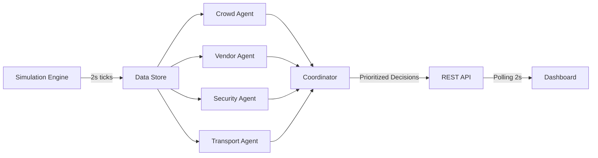
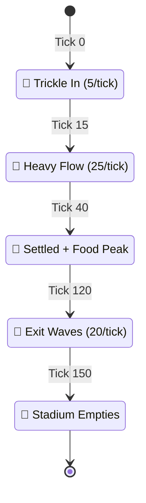
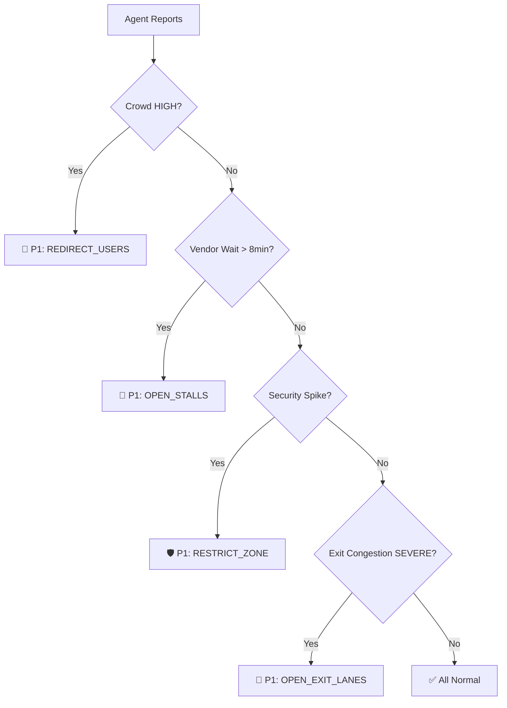

# 🏟️ StadiumOS — Multi-Agent Coordination Engine

<div align="center">


**A real-time intelligent system that simulates and optimizes operations inside a large-scale sports stadium using multiple AI agents.**

[Getting Started](#-getting-started) · [Architecture](#-system-architecture) · [Agents](#-agent-layer) · [Dashboard](#-frontend-dashboard) · [Deployment](#-deployment)

</div>

---

## 📖 Overview

StadiumOS is a **system-level intelligence platform** that demonstrates multi-agent coordination for stadium operations management. It simulates real-time crowd behavior across stadium zones and uses four specialized AI agents coordinated by a central decision engine to produce actionable operational recommendations.

### Key Features

- 🎯 **Real-Time Simulation** — 500–1000 users moving across 6 stadium zones with a 5-phase event lifecycle
- 🤖 **Multi-Agent System** — 4 independent agents (Crowd, Vendor, Security, Transport) analyzing different operational dimensions
- 🧠 **Central Coordinator** — Rule-based decision engine that combines agent outputs into prioritized, actionable recommendations
- 📊 **Live Dashboard** — Interactive map with Leaflet.js, real-time metrics, and decision panel updating every 2 seconds
- 🔥 **Firebase Integration** — Optional Firestore mirroring for persistent state (works fully in-memory without it)
- 🐳 **Cloud-Ready** — Single-container Docker deployment for Google Cloud Run

---

## 🏗️ System Architecture

```
┌─────────────────────────────────────────────────────────────────────┐
│                        StadiumOS Engine                             │
│                                                                     │
│  ┌──────────────┐    ┌──────────┐    ┌─────────────────────────┐   │
│  │  Simulation   │───▶│  Data    │───▶│      Agent Layer        │   │
│  │  Engine       │    │  Store   │    │                         │   │
│  │  (2s ticks)   │    │ (Memory  │    │  ┌─────┐ ┌──────┐      │   │
│  │              │    │  + Fire-  │    │  │Crowd│ │Vendor│      │   │
│  └──────────────┘    │  store)   │    │  └──┬──┘ └──┬───┘      │   │
│                      └──────────┘    │     │       │           │   │
│                                      │  ┌──┴──┐ ┌──┴──────┐   │   │
│                                      │  │Secur│ │Transport│   │   │
│                                      │  └──┬──┘ └──┬──────┘   │   │
│                                      └─────┼───────┼──────────┘   │
│                                            │       │               │
│                                      ┌─────▼───────▼──────────┐   │
│                                      │    Coordinator Engine   │   │
│                                      │  (Rule-based decisions) │   │
│                                      └────────────┬────────────┘   │
│                                                   │                │
│                                      ┌────────────▼────────────┐   │
│                                      │      REST API           │   │
│                                      │  /status /zones /agents │   │
│                                      │  /decisions /system     │   │
│                                      └────────────┬────────────┘   │
└───────────────────────────────────────────────────┼────────────────┘
                                                    │
                                       ┌────────────▼────────────┐
                                       │   Next.js Dashboard     │
                                       │  Map │ Metrics │ Decide │
                                       └─────────────────────────┘
```

### Data Flow



### Event Lifecycle



---

## 🧠 Agent Layer

| Agent | Input | Analysis | Output |
|-------|-------|----------|--------|
| **👥 Crowd Agent** | Zone occupancy data | Capacity ratio against thresholds (50%/75%/90%) | `LOW` / `MEDIUM` / `HIGH` density per zone |
| **🍔 Vendor Agent** | Food court queue + service rate | Wait time = queue ÷ effective service rate | Wait time (min) + `OVERLOADED` flag |
| **🛡️ Security Agent** | Rolling 10-tick history | 30% spike detection + sustained-high monitoring | `ALERT` / `WARNING` / `NORMAL` |
| **🚌 Transport Agent** | Gate flow rates + total users | Net flow tracking + clear-time estimation | Congestion level + departure recommendations |

### Coordinator Decision Rules



**Priority Levels:** `CRITICAL (P1)` → `HIGH (P2)` → `MEDIUM (P3)` → `INFO (P4)`

---

## 📂 Project Structure

```
stadiumos/
├── backend/
│   ├── server.js                        # Express entry + API routes + production serving
│   ├── package.json
│   ├── .env.example                     # Environment template
│   └── src/
│       ├── config/
│       │   └── firebase.js              # Firebase Admin SDK init
│       ├── models/
│       │   └── stadium.js               # Zone definitions (6 zones)
│       ├── simulation/
│       │   ├── engine.js                # 5-phase simulation loop
│       │   └── store.js                 # In-memory store + Firestore sync
│       ├── agents/
│       │   ├── index.js                 # Barrel export + runAll()
│       │   ├── crowdAgent.js            # Density monitoring
│       │   ├── vendorAgent.js           # Queue optimization
│       │   ├── securityAgent.js         # Spike detection
│       │   └── transportAgent.js        # Exit flow control
│       └── coordinator/
│           └── index.js                 # Decision engine
├── frontend/
│   ├── next.config.ts                   # Standalone output config
│   ├── package.json
│   └── src/
│       ├── app/
│       │   ├── layout.tsx               # Root layout (dark mode)
│       │   ├── globals.css              # Design tokens + Leaflet dark theme
│       │   ├── page.tsx                 # Landing page
│       │   └── dashboard/
│       │       └── page.tsx             # Live dashboard (3-column)
│       ├── components/
│       │   ├── StadiumMap.tsx           # Leaflet map with dynamic markers
│       │   ├── MetricsPanel.tsx         # 6 live metric cards
│       │   └── DecisionPanel.tsx        # Priority-sorted decisions
│       ├── hooks/
│       │   └── usePolling.ts            # 2-second polling hook
│       └── lib/
│           └── api.ts                   # API client utilities
├── Dockerfile                           # Multi-stage Docker build
├── .dockerignore
├── DEPLOY.md                            # Cloud Run deployment guide
└── README.md
```

---

## 🚀 Getting Started

### Prerequisites

- **Node.js** ≥ 18
- **npm** ≥ 9
- (Optional) Firebase project for Firestore persistence

### 1. Clone the repo

```bash
git clone https://github.com/arpitpandey0307/Stadium-OS.git
cd Stadium-OS
```

### 2. Start the Backend

```bash
cd backend
cp .env.example .env     # Edit with your Firebase project ID (optional)
npm install
npm run dev              # → http://localhost:8080
```

The simulation starts automatically. You should see tick logs in the console:
```
🏟️  StadiumOS Backend running on http://localhost:8080
🏟️  Simulation Engine starting...
   🎯 Tick 5 | Phase: pre-event | Users: 25 | A:10 B:9 C:6 FC:0(q0)
```

### 3. Start the Frontend

```bash
cd frontend
npm install
npm run dev              # → http://localhost:3000
```

### 4. Open the Dashboard

Visit **https://stadium-os-795750315067.us-central1.run.app** and watch the simulation unfold in real time.

---

## 📊 API Reference

| Endpoint | Method | Description |
|----------|--------|-------------|
| `/` | GET | Health check |
| `/api/status` | GET | Full system state (zones + system info) |
| `/api/zones` | GET | All zone data with current occupancy |
| `/api/system` | GET | System info (tick, phase, total users) |
| `/api/agents` | GET | Reports from all 4 agents |
| `/api/decisions` | GET | Coordinator decisions + agent reports |
| `/api/simulation/start` | POST | Start the simulation |
| `/api/simulation/stop` | POST | Stop the simulation |
| `/api/simulation/reset` | POST | Reset to initial state |

---

## 🖥️ Frontend Dashboard

The dashboard features a 3-column layout that updates every 2 seconds:

```
┌──────────────┬──────────────────────────┬──────────────────┐
│              │                          │                  │
│   Metrics    │      Stadium Map         │   Coordinator    │
│   Panel      │   (Leaflet + dark tiles  │   Decisions      │
│              │    + dynamic markers)    │   (priority      │
│  · Users     │                          │    sorted)       │
│  · Density   │   Zone A ●              │                  │
│  · Food Ct   │        Zone B ●         │  🚨 CRITICAL     │
│  · Security  │   Food ●    Zone C ●    │  ⚠️  HIGH        │
│  · Transport │        Entry ●          │  ℹ️  INFO        │
│  · Net Flow  │        Exit ●           │                  │
│              │                          │                  │
└──────────────┴──────────────────────────┴──────────────────┘
```

- **Map markers** change color (🟢 normal → 🟡 warning → 🔴 critical) and size based on zone load
- **Metrics** show live agent outputs with color-coded status badges
- **Decisions** appear with CRITICAL/HIGH/MEDIUM/INFO priority labels

---

## 🐳 Deployment

### Docker

```bash
docker build -t stadiumos .
docker run -p 8080:8080 -e NODE_ENV=production stadiumos
```

### Google Cloud Run

```bash
export PROJECT_ID=your-gcp-project-id

# Build & Push
gcloud builds submit --tag gcr.io/$PROJECT_ID/stadiumos

# Deploy
gcloud run deploy stadiumos \
  --image gcr.io/$PROJECT_ID/stadiumos \
  --platform managed \
  --region us-central1 \
  --allow-unauthenticated \
  --set-env-vars NODE_ENV=production,FIREBASE_PROJECT_ID=$PROJECT_ID \
  --memory 512Mi
```

---

## ⚙️ Tech Stack

| Layer | Technology | Purpose |
|-------|-----------|---------|
| **Runtime** | Node.js 20 | Server-side JavaScript |
| **API** | Express.js | REST API framework |
| **Database** | Firebase Firestore | Real-time NoSQL (optional) |
| **Frontend** | Next.js 16 | React framework with App Router |
| **Styling** | Tailwind CSS v4 | Utility-first CSS |
| **Map** | Leaflet.js | Interactive stadium visualization |
| **Container** | Docker | Multi-stage build |
| **Cloud** | Google Cloud Run | Serverless deployment |

---

## 🧪 Stadium Zones

| Zone | Type | Capacity | Description |
|------|------|----------|-------------|
| Zone A — North Stand | Crowd | 300 | Main seating (40% weight) |
| Zone B — East Stand | Crowd | 250 | Secondary seating (35% weight) |
| Zone C — South Stand | Crowd | 200 | Tertiary seating (25% weight) |
| Food Court | Vendor | 150 | 3–6 dynamic stalls, queue-based |
| Entry Gate | Gate | 100 | Ingress tracking |
| Exit Gate | Gate | 100 | Egress + congestion monitoring |

---

## 📝 License

This project is licensed under the **MIT License** — see the [LICENSE](./LICENSE) file for details.

---

<div align="center">
  <strong>Built with ❤️ by <a href="https://github.com/arpitpandey0307">Arpit Pandey</a></strong>
</div>
